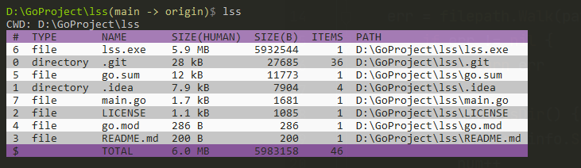
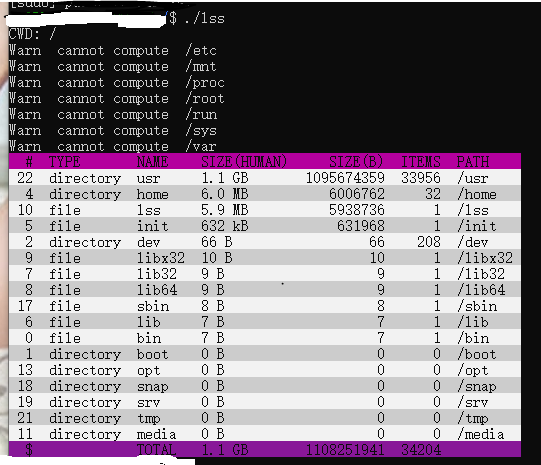

# lss: 
list **size** of file/**folder** in the current working directory,
while operating system can not provide folder size

features:
+ high performance using goroutine
+ sort from big to small 
+ list count of items concurrently
+ auto skip permission errors


## how to test
```
go run main.go
```

## how to deploy
```
go build -ldflags "-w"
# for linux
env GOOS=linux GOARCH=amd64 go build -ldflags "-w"
add lss.exe folder to envrionment $PATH 
lss 
```

## demo
windows



linux



